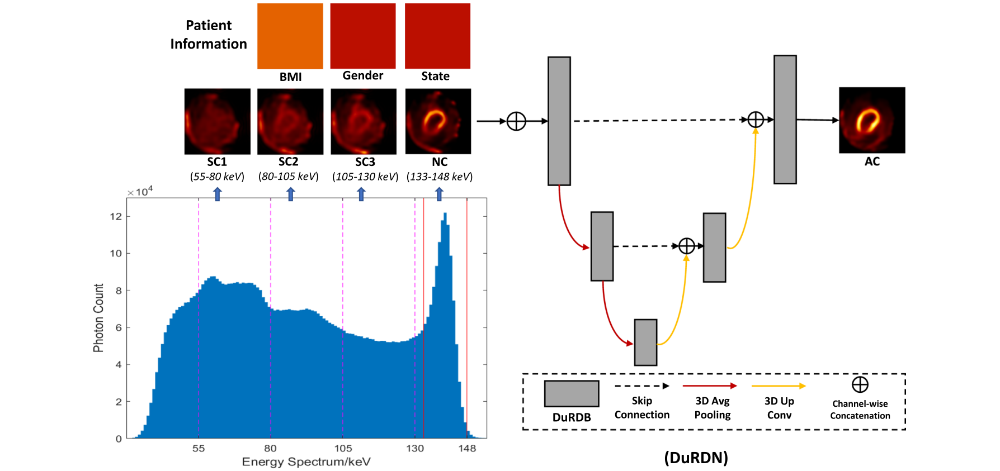

  

**Xiongchao Chen**, Bo Zhou, Luyao Shi, et al. *Journal of Nuclear Cardiology (**JNC**)*, 2021.  
[[Paper Link](https://link.springer.com/article/10.1007/s12350-021-02672-0)] [[Code Link](https://github.com/XiongchaoChen/DuRDN_CardiacSPECT_AC)]  

