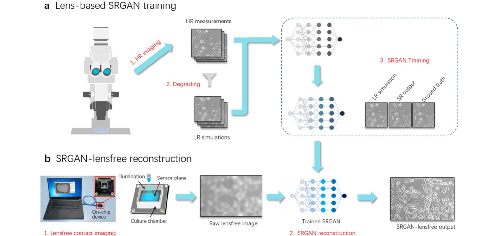

  

<!--    -->
Hao Zhang, Tingting Zhu, **Xiongchao Chen**, Lanxin Zhu, Di Jin, Peng Fei  
 Journal of Physics D: Applied Physics, 2021.  
[[Paper Link](https://iopscience.iop.org/article/10.1088/1361-6463/ac1138)]
[Code Link]  

