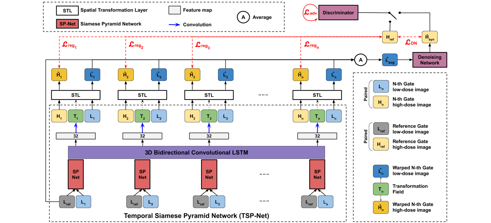

  

<!--    -->
Bo Zhou, Yu-Jung Tsai, **Xiongchao Chen**, James S Duncan, Chi Liu  
IEEE transactions on medical imaging **(TMI)**, 2021.  
[[Paper Link](https://ieeexplore.ieee.org/document/9417093)]
[[Code Link](https://github.com/bbbbbbzhou/MDPET)]  

