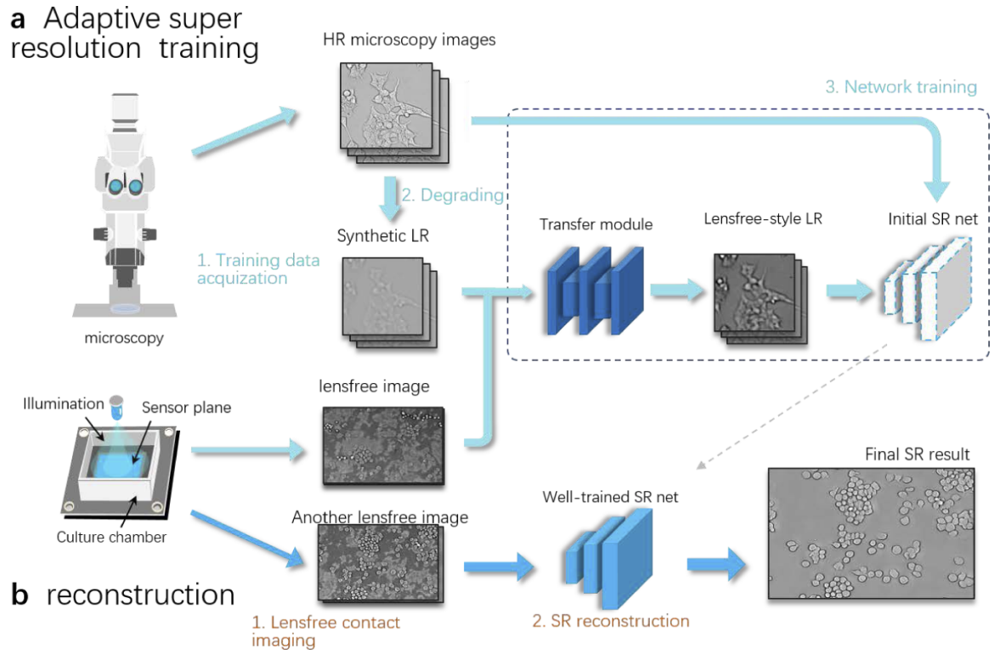

  
Hao Zhang\*, **Xiongchao Chen\***, Tingting Zhu, Chengqiang Yi, Peng Fei  
Optics Express **(OE)**, 2021.  
\*Equal contribution.  
[[Paper Link](https://opg.optica.org/OE/fulltext.cfm?uri=oe-29-20-31754)]
[[Code Link]]  

