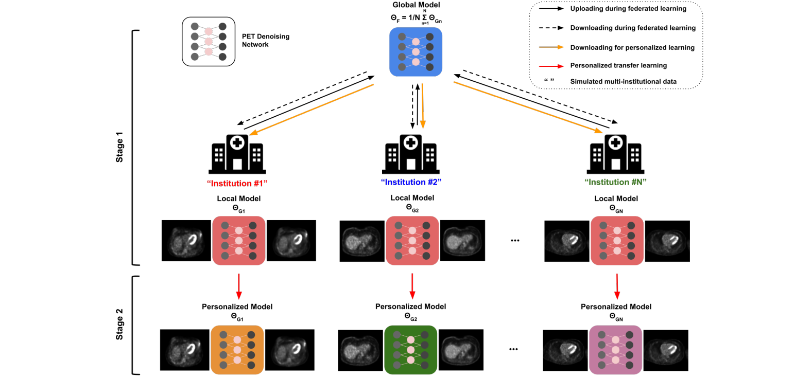

<!--    -->

  

Bo Zhou, Tianshun Miao, Niloufar Mirian, **Xiongchao Chen**, et al. *IEEE Transactions on Radiation and Plasma Medical Sciences **(TRPMS)**, 2022*. [[Paper Link](https://ieeexplore.ieee.org/document/9843905)]

