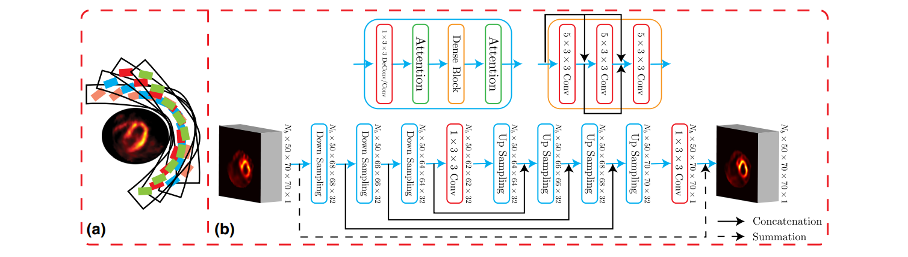

<!--    -->

  

Huidong Xie, Stephanie Thorn, **Xiongchao Chen**, et al.  
Journal of Nuclear Cardiology **(JNC)**, 2022.  
[[Paper Link](https://link.springer.com/article/10.1007/s12350-022-02972-z)]
[Code Link]  

