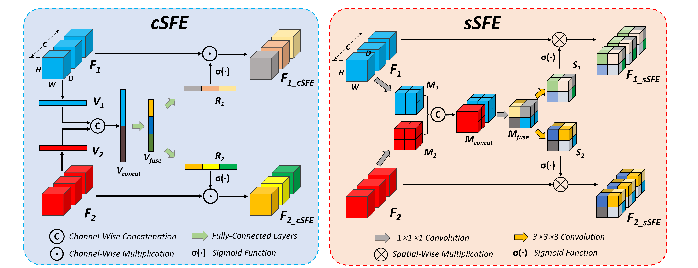

<!--    -->

  

**Xiongchao Chen**, Bo Zhou, Huidong Xie, et al. Medical Image Computing and Computer-Assisted Intervention **(MICCAI)**, 2022. [[Paper Link](https://link.springer.com/chapter/10.1007/978-3-031-16446-0_5)] [[Code Link](https://github.com/XiongchaoChen/DuSFE_CrossRegistration)]  
