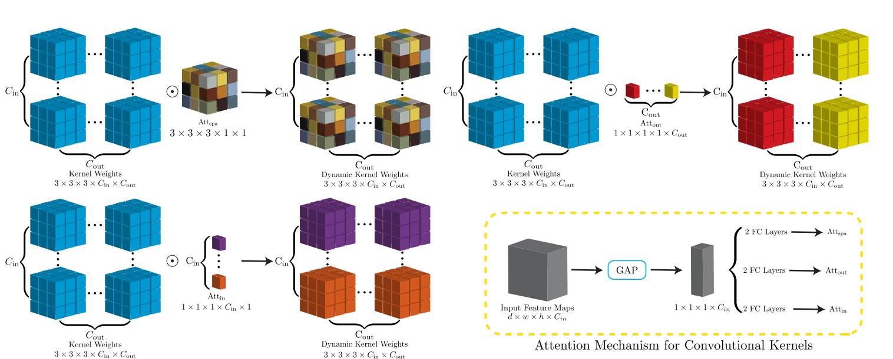

  
Huidong Xie, Zhao Liu, Luyao Shi, Kathleen Greco, **Xiongchao Chen**, Bo Zhou, Attila Feher, John C Stendahl, Nabil Boutagy, Tassos C Kyriakides, Ge Wang, Albert J Sinusas, Chi Liu.
[[Paper Link](https://ieeexplore.ieee.org/document/9969636)]
[Code Link]
