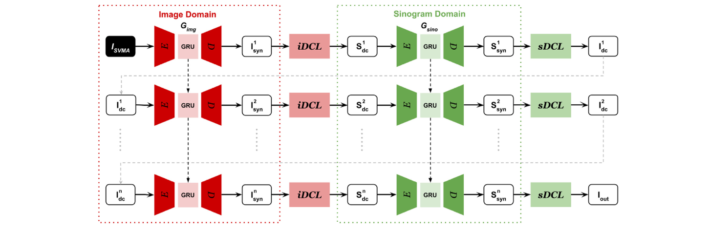

  
Bo Zhou, **Xiongchao Chen**, S Kevin Zhou, James S Duncan, Chi Liu  
Medical Image Analysis **(MedIA)**, 2022.  
[[Paper Link](https://www.sciencedirect.com/science/article/pii/S1361841521003340)]
[[Code Link](https://github.com/bbbbbbzhou/DuDoRNet)]  

