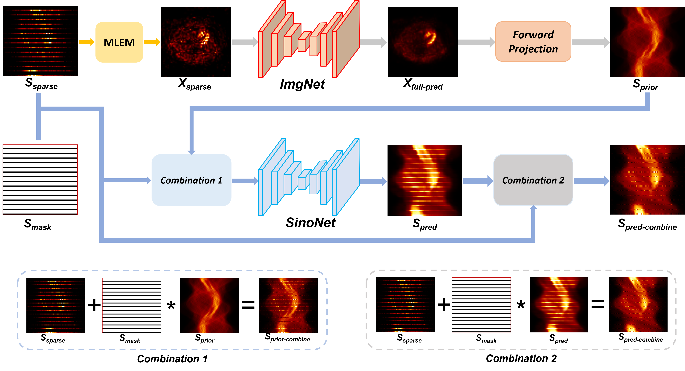

  
**Xiongchao Chen**, Bo Zhou, Huidong Xie, Tianshun Miao, Hui Liu, Wolfgang Holler, MingDe Lin, Edward J Miller, Richard E Carson, Albert J Sinusas, Chi Liu  
Medical Physics **(MedPhy)**, 2022.  
[[Paper Link](https://aapm.onlinelibrary.wiley.com/doi/10.1002/mp.15958)]
[Code Link]  

