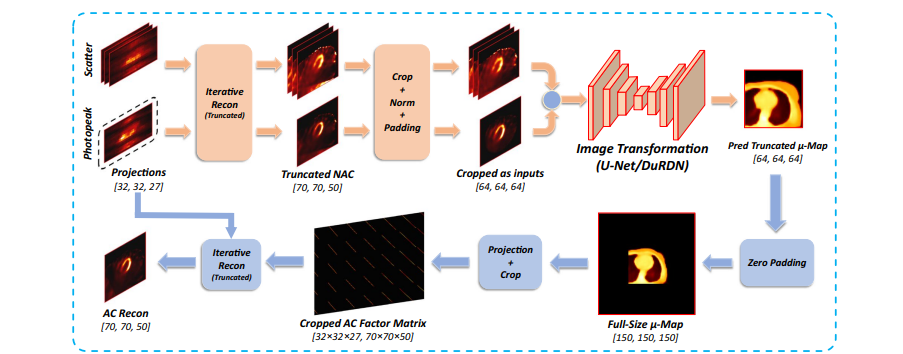

<!--  -->

  

**Xiongchao Chen**, Bo Zhou, Huidong Xie, Luyao Shi, Hui Liu, Wolfgang Holler, MingDe Lin, Yi-Hwa Liu, Edward J Miller, Albert J Sinusas, Chi Liu  
European Journal of Nuclear Medicine and Molecular Imaging **(EJNMMI)**, 2022.  
[[Paper Link](https://link.springer.com/article/10.1007/s00259-022-05718-8)]
[Code Link]  

