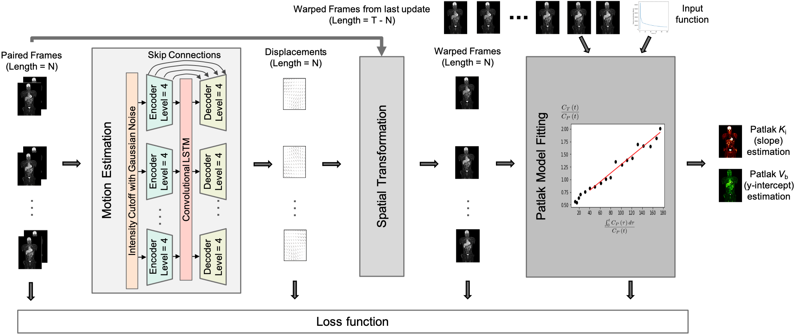

<!--    -->

  

Xueqi Guo, Bo Zhou, **Xiongchao Chen**, et al. Medical Image Computing and Computer-Assisted Intervention **(MICCAI)**, 2022. [[Paper Link](https://link.springer.com/chapter/10.1007/978-3-031-16440-8_16)] [[Code](https://github.com/gxq1998/MCP-Net)]  

