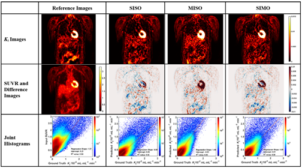

  

Tianshun Miao, Bo Zhou, Juan Liu, Xueqi Guo, Qiong Liu, Huidong Xie, **Xiongchao Chen**, et al. *IEEE Transactions on Radiation and Plasma Medical Sciences*, 2023.

[[Paper Link](https://ieeexplore.ieee.org/abstract/document/10049744)]
